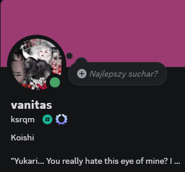

# Twitch Song Request Bot

A Twitch bot that allows viewers to request YouTube songs directly from chat.

The bot validates YouTube videos, adds them to a queue, filters long songs, and automatically plays requested songs using a dedicated browser profile.

## Features

* Twitch chat integration
* YouTube video validation
* Automatic song queue
* Maximum song duration filtering
* Queue display
* Skip current song
* Browser-based playback
* Separate browser profile for the bot

## Commands

### Request a song

```
!song <youtube_video_id>
```

Example:

```
!song 8SPtkjMUkGk
```

### Show queue

```
!queue
```

Displays the first songs waiting in the queue.

### Skip current song

```
!skip
```

Skips the currently playing song.

---

# Installation

## Requirements

* Python 3.10+
* Git
* Brave Browser (recommended)
* Twitch bot account
* YouTube account for the bot

---

## Clone the repository

```bash
git clone <repository_url>
cd TwitchsrBot
```

---

## Create virtual environment

### Windows

```powershell
python -m venv .venv
.venv\Scripts\activate
```

### Linux / macOS

```bash
python3 -m venv .venv
source .venv/bin/activate
```

---

## Install dependencies

```bash
pip install -r requirements.txt
```

Install Playwright dependencies:

```bash
playwright install
```

---

# Configuration

Create a `.env` file based on `.env.example`.

Windows:

```powershell
copy .env.example .env
```

Linux / macOS:

```bash
cp .env.example .env
```

Edit the `.env` file and fill in your values.

Example:

```env
TWITCH_TOKEN=oauth:your_token_here
TWITCH_CHANNEL=your_channel_name

BROWSER_USER_DATA_DIR=./brave_bot_profile
BROWSER_EXECUTABLE_PATH=C:/Program Files/BraveSoftware/Brave-Browser/Application/brave.exe
```

## Notes

* Do not upload `.env` to GitHub.
* Do not upload browser profiles.
* Do not use quotes around `.env` values.

---

# Browser setup

The bot uses a separate browser profile.

Recommended browser: Brave.

On the first launch:

1. Start the bot.
2. A browser window will open.
3. Log into the YouTube account dedicated for the bot.
4. Close the bot.

The browser session will be saved and reused on future launches.

---

# Running the bot

Activate the virtual environment.

Windows:

```powershell
.venv\Scripts\activate
```

Linux / macOS:

```bash
source .venv/bin/activate
```

Run:

```bash
python bot.py
```

---

# Project structure

```
TwitchsrBot/
│
├── bot.py              # Main Twitch bot
├── player.py           # Browser playback system
├── q.py                # Queue management
├── link_check.py       # YouTube validation
│
├── requirements.txt    # Python dependencies
├── .env.example        # Configuration example
├── .gitignore
└── README.md
```

---

# Security

Never upload:

```
.env
.venv/
brave_bot_profile/
__pycache__/
```

These files may contain private data and should stay local.

# Note
in case of problems or questions you can reach me on discord

ksrqm aka Vanitas


